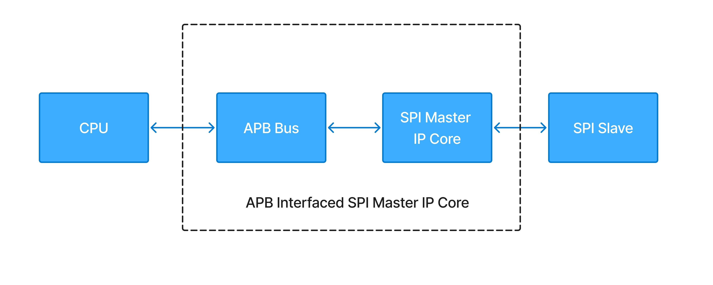

# custom-spi-master

This project implements a **custom-designed SPI Master IP Core** interfaced via the **APB protocol**, written in Verilog HDL. It enables a CPU (or APB master) to perform full-duplex serial communication with SPI-compatible devices using memory-mapped control and data registers.





 **Developed during the Maven Silicon VLSI Design Internship Program**

>  *Note: This is a **custom** RTL implementation, not based on any standard IP core. Intended strictly for learning and academic purposes. Unauthorized reuse for academic submission is prohibited.*

---

##  Repository Structure

```
├── rtl/ 
├── tb/ 
├── docs/ 
│   └── design_details.md
└── README.md 
```

---

##  Key Features

*  Fully APB-compliant slave interface
*  Full-duplex 8-bit SPI transfer support
*  Configurable CPOL, CPHA (Modes 0–3)
*  Programmable baud rate (SPPR & SPR)
*  MSB-first or LSB-first selection
*  Auto-controlled slave select (`ss`)
*  Interrupt request output for SPI complete or error
*  Modular RTL hierarchy (4 blocks)

---

##  Top-Level I/O Pins

| Signal                  | Dir | Description                            |
| ----------------------- | --- | -------------------------------------- |
| `PCLK`                  | In  | System clock input                     |
| `PRESETn`               | In  | Active-low asynchronous reset          |
| `PADDR[2:0]`            | In  | APB address input                      |
| `PWDATA[7:0]`           | In  | Write data bus                         |
| `PRDATA[7:0]`           | Out | Read data bus                          |
| `PWRITE`                | In  | High for write, Low for read           |
| `PSEL`                  | In  | Select signal from APB master          |
| `PENABLE`               | In  | Enable signal for second APB phase     |
| `PREADY`                | Out | Indicates transfer complete            |
| `PSLVERR`               | Out | Transfer error flag                    |
| `mosi`                  | Out | Master Out, Slave In (serial data out) |
| `miso`                  | In  | Master In, Slave Out (serial data in)  |
| `sclk`                  | Out | SPI Clock output                       |
| `ss`                    | Out | Active-low slave select                |
| `spi_interrupt_request` | Out | Raised on transfer complete or error   |

---

##  SPI Modes (CPOL/CPHA)

| Mode | CPOL | CPHA | Clock Idle | Sample Edge | Shift Edge |
| ---- | ---- | ---- | ---------- | ----------- | ---------- |
| 0    | 0    | 0    | LOW        | Rising      | Falling    |
| 1    | 0    | 1    | LOW        | Falling     | Rising     |
| 2    | 1    | 0    | HIGH       | Falling     | Rising     |
| 3    | 1    | 1    | HIGH       | Rising      | Falling    |

These are configured via **SPI\_CR1** using `CPOL`, `CPHA` bits.

---

##  Timing Flags & Control Signals

| Signal         | Function                                                 |
| -------------- | -------------------------------------------------------- |
| `flags_low`    | Asserts 1 PCLK before falling edge of SCLK (MOSI shift)  |
| `flags_high`   | Asserts 1 PCLK before rising edge of SCLK (MOSI shift)   |
| `flag_low`     | Used to sample MISO on falling edge of SCLK              |
| `flag_high`    | Used to sample MISO on rising edge of SCLK               |
| `send_data`    | Set by APB interface to begin transfer                   |
| `receive_data` | Set after 8-bit transfer completes                       |
| `ss`           | Automatically toggled LOW before and HIGH after transfer |

 **For waveform examples and FSM timing:**
See [`docs/design_details.md`](docs/design_details.md)
---

##  Register Map

| Addr   | Register | Access | Description                                  |
| ------ | -------- | ------ | -------------------------------------------- |
| `0x00` | SPI\_CR1 | RW     | Control Register 1 (CPOL, CPHA, LSBFE, MSTR) |
| `0x01` | SPI\_CR2 | RW     | Control Register 2 (SPISWAI, interrupts)     |
| `0x02` | SPI\_BR  | RW     | Baud Rate (SPPR & SPR)                       |
| `0x03` | SPI\_SR  | RO     | Status (SPIF, SPTEF)                         |
| `0x05` | SPI\_DR  | RW     | Data Register (read/write serial byte)       |

Reserved bits are masked to prevent accidental overwrite.

---

##  Simulation & Validation

*  Simulated with **ModelSim**
*  Test cases include:
*  Synthesis validated in **Intel Quartus Prime**

---

##  Documentation

*  [Design Details (Timing + Logic)](docs/design_details.md)
*  [`Simulation results`](docs/waveforms/waveforms.pdf)
---

##  References

* **AMBA APB Protocol Specification** – ARM Ltd.
* **Serial Peripheral Interface (SPI) Block Guide – S12SPIV3** – Motorola/Freescale
* **Custom RTL Implementation** – Original design by the author for educational use

---
##  Legal & Academic Disclaimer

This project was developed as part of the **Maven Silicon VLSI Design Internship Program** (Summer 2025). The implementation, testbenches, and documentation were created independently by the author for academic learning.

> This repository does **not** reproduce or disclose any proprietary content, material, or code provided by Maven Silicon. It is based on original RTL work developed using public specifications (AMBA, SPI) and knowledge gained during training.

All rights to Maven Silicon’s training content, evaluation criteria, and proprietary tools remain the property of **Maven Silicon Pvt. Ltd.**

License: MIT
